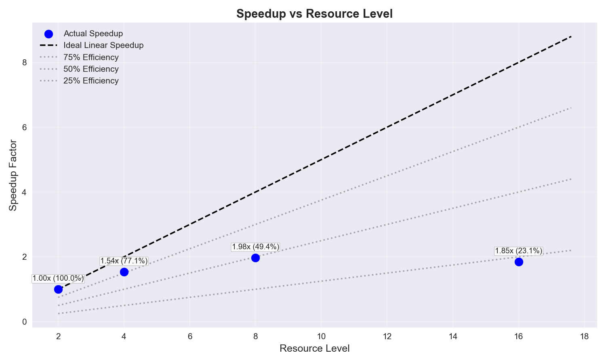
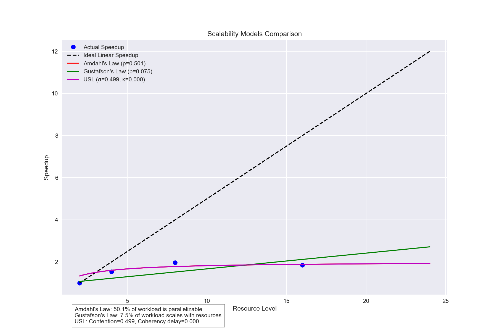
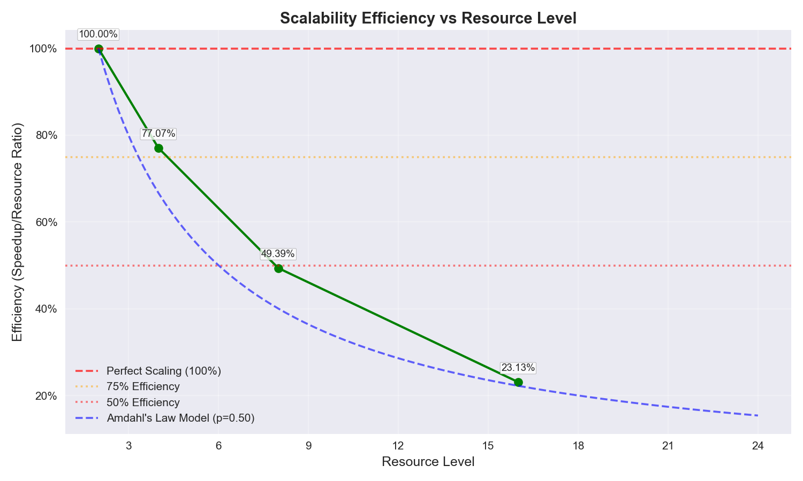
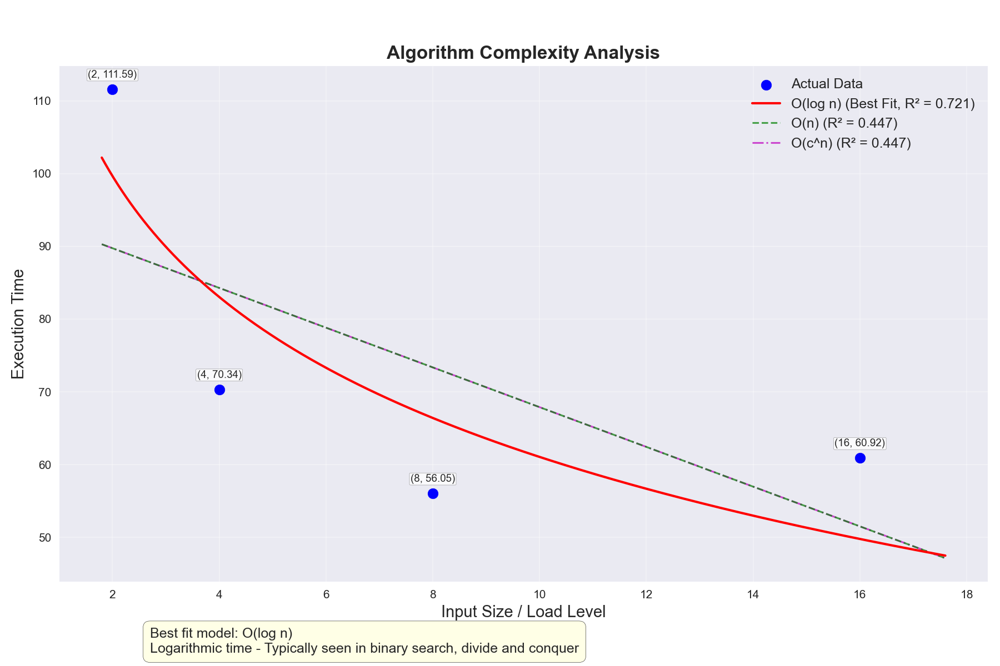
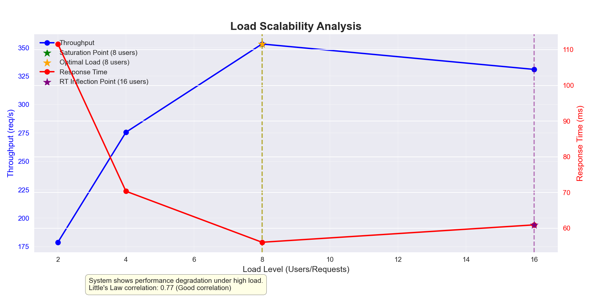

# Windsurf Scalability Testing Framework: Comprehensive Documentation

## Table of Contents
1. [Introduction](#introduction)
2. [Theoretical Foundations](#theoretical-foundations)
   - [Amdahl's Law](#amdahls-law)
   - [Gustafson's Law](#gustafsons-law)
   - [Universal Scalability Law](#universal-scalability-law)
   - [Algorithm Complexity Analysis](#algorithm-complexity-analysis)
3. [Framework Architecture](#framework-architecture)
   - [Core Components](#core-components)
   - [Data Processing Pipeline](#data-processing-pipeline)
   - [Visualization Components](#visualization-components)
   - [Reporting Modules](#reporting-modules)
4. [Testing and Analysis Process](#testing-and-analysis-process)
   - [Test Data Requirements](#test-data-requirements)
   - [Analysis Workflow](#analysis-workflow)
   - [Synthetic Data Generation](#synthetic-data-generation)
5. [Interpreting Results](#interpreting-results)
   - [Basic Scalability Metrics](#basic-scalability-metrics)
   - [Advanced Scalability Analysis](#advanced-scalability-analysis)
   - [Optimization Recommendations](#optimization-recommendations)
6. [Example Analysis](#example-analysis)
   - [USL Model Test Case](#usl-model-test-case)
   - [Visualizations and Insights](#visualizations-and-insights)
7. [Advanced Features](#advanced-features)
   - [Cost Efficiency Analysis](#cost-efficiency-analysis)
   - [Load Scalability Analysis](#load-scalability-analysis)
   - [Theoretical Projections](#theoretical-projections)
8. [References](#references)

## Introduction

The Windsurf Scalability Testing Framework is a comprehensive solution designed to analyze the scalability characteristics of systems under test. It provides tools for analyzing performance test results across different resource configurations, modeling scalability behavior, and generating detailed reports with actionable insights.

Scalability testing is crucial for understanding how a system's performance changes as resources are added or workload increases. This framework implements well-established mathematical models to quantify scalability characteristics and identify potential bottlenecks that may limit system performance at scale.

Key capabilities of the framework include:
- Analysis of JMeter JTL files from performance tests run at different resource levels
- Implementation of three major scalability laws (Amdahl's, Gustafson's, Universal Scalability Law)
- Advanced visualization of scalability metrics and trends
- Comprehensive reporting in multiple formats (Markdown, HTML, DOCX)
- Theoretical projections for performance at untested resource levels
- Synthetic data generation for model validation and testing

## Theoretical Foundations

### Amdahl's Law

Amdahl's Law, formulated by Gene Amdahl in 1967, describes the theoretical speedup in latency of the execution of a task at fixed workload that can be expected of a system whose resources are improved.

The mathematical formula for Amdahl's Law is:

```
Speedup(n) = 1 / ((1 - p) + p/n)
```

Where:
- `n` is the number of processors/resources
- `p` is the proportion of execution time that benefits from improved resources (parallelizable portion)
- `(1 - p)` is the proportion that cannot benefit (serial portion)

```
Program Execution Time:
+-------------------+-----------------------------------+
| Serial Portion    | Parallelizable Portion           |
| (1-p)             | (p)                              |
+-------------------+-----------------------------------+
```



*Figure 2: Amdahl's Law - Visualizing the impact of serial vs. parallelizable code on speedup*

**Key Implications:**
- The maximum speedup is limited by the serial portion of the workload
- As `n` approaches infinity, the maximum speedup approaches `1/(1-p)`
- If 50% of a program is parallelizable (p=0.5), the maximum speedup is 2x, regardless of how many processors are added

The framework fits observed performance data to Amdahl's Law to estimate the parallelizable portion of the system under test, providing insights into the theoretical maximum speedup achievable.

**Visualization Note:** Amdahl's Law shows how speedup increases with more processors but eventually plateaus. For example, with p=0.9, speedup increases rapidly up to about 32 processors then levels off around 10x. With p=0.5, speedup plateaus at just 2x regardless of how many processors are added.

### Gustafson's Law

Gustafson's Law, formulated by John L. Gustafson in 1988, addresses the limitations of Amdahl's Law by considering that the problem size often scales with the number of processors. It focuses on scaled speedup rather than fixed-size speedup.

The mathematical formula for Gustafson's Law is:

```
Speedup(n) = (1 - p) + n * p
```

Where:
- `n` is the number of processors/resources
- `p` is the proportion of execution time that benefits from improved resources (parallelizable portion)
- `(1 - p)` is the proportion that cannot benefit (serial portion)

**Key Implications:**
- Unlike Amdahl's Law, Gustafson's Law suggests that speedup can continue to increase with more processors
- It assumes that the problem size increases with the number of processors
- It is particularly relevant for systems where the workload can grow with available resources

The framework fits observed performance data to Gustafson's Law to estimate the scalable portion of the system under test, providing insights into how well the system scales with increasing workload.

### Universal Scalability Law

The Universal Scalability Law (USL), developed by Dr. Neil Gunther, extends Amdahl's Law by adding a term to account for coherency delays that can cause performance to actually decrease as more resources are added.

The mathematical formula for the USL is:

```
Speedup(n) = n / (1 + σ(n-1) + κn(n-1))
```

Where:
- `n` is the number of processors/resources
- `σ` (sigma) is the contention/serialization factor
- `κ` (kappa) is the coherency delay factor



*Figure 3: Comparison of Linear Scaling, Amdahl's Law, and Universal Scalability Law*

```
USL Components:
+------------------------+    +------------------------+
| Contention/            |    | Coherency Delay        |
| Serialization (σ)      |    | (κ)                    |
+------------------------+    +------------------------+
          |                              |
          v                              v
+------------------------+    +------------------------+
| Diminishing Returns    |    | Negative Returns      |
+------------------------+    +------------------------+
```

*Figure 4: Universal Scalability Law Components*

**Key Implications:**
- When `κ` > 0, there is a point where adding more resources actually decreases performance
- The USL can model three regions of scalability: linear growth, diminishing returns, and negative returns
- It provides a more realistic model for real-world systems with communication overhead

### Algorithm Complexity Analysis

Algorithm complexity analysis examines how the computational requirements of an algorithm scale with input size. The framework includes tools to analyze the relationship between resource levels and performance metrics to identify the underlying algorithmic complexity.

Common complexity classes analyzed include:
- O(1): Constant time
- O(log n): Logarithmic time
- O(n): Linear time
- O(n log n): Log-linear time
- O(n²): Quadratic time
- O(n³): Cubic time
- O(2ⁿ): Exponential time

**Key Implications:**
- Understanding algorithm complexity helps predict how a system will scale with larger inputs
- It can identify inefficient algorithms that may become bottlenecks at scale
- It provides guidance for optimization efforts by highlighting areas with suboptimal complexity

## Framework Architecture

The Windsurf Scalability Testing Framework follows a modular architecture with specialized components for different aspects of scalability analysis.

```
+----------------+      +------------------+
| JMeter JTL     |----->| Core Module      |
| Files          |      | scalability_core |
+----------------+      +------------------+
        ^                    |       |       \
        |                    v       v        v
+----------------+    +----------+ +----------+ +----------------+
| Synthetic Data |    | Models   | | Algorithm| | Load          |
| Generator      |    | Module   | | Complex. | | Scalability   |
+----------------+    +----------+ +----------+ +----------------+
                           |           |            |
                           v           v            v
                      +--------------------------------+
                      | Visualization Module           |
                      +--------------------------------+
                         |           |           |
                         v           v           v
                 +----------+  +----------+  +----------+
                 | Markdown |  | HTML     |  | DOCX     |
                 | Reports  |  | Reports  |  | Reports  |
                 +----------+  +----------+  +----------+
```

*Figure 1: Framework Architecture Diagram*

### Core Components

1. **Core Module (`scalability_core.py`)**: 
   - Provides fundamental functionality for parsing JTL files
   - Calculates basic performance metrics (throughput, response time, error rate)
   - Implements data normalization and preprocessing

2. **Models Module (`scalability_models.py`)**:
   - Implements mathematical models for scalability laws
   - Provides curve fitting algorithms to match observed data to theoretical models
   - Generates interpretations and recommendations based on model parameters

3. **Algorithm Complexity Module (`algorithm_complexity.py`)**:
   - Analyzes the relationship between resource levels and performance metrics
   - Fits observed data to different complexity models
   - Identifies the best-fitting complexity class

4. **Load Scalability Module (`load_scalability.py`)**:
   - Analyzes how system performance changes with increasing load
   - Identifies saturation points and optimal operating points
   - Models capacity and provides load-related recommendations

### Data Processing Pipeline

The framework processes data through the following pipeline:

1. **Data Ingestion**: 
   - Parse JTL files from JMeter tests
   - Extract timestamps, response times, and status codes
   - Group data by transaction type if multiple are present

2. **Metric Calculation**:
   - Calculate throughput (requests per second)
   - Calculate response time statistics (average, percentiles)
   - Calculate error rates
   - Normalize metrics across different resource levels

3. **Model Fitting**:
   - Fit observed speedup data to Amdahl's Law
   - Fit observed speedup data to Gustafson's Law
   - Fit observed speedup data to Universal Scalability Law
   - Calculate goodness of fit for each model

4. **Analysis Generation**:
   - Generate interpretations based on model parameters
   - Identify potential bottlenecks and limitations
   - Create optimization recommendations
   - Generate theoretical projections

### Visualization Components

The framework includes comprehensive visualization capabilities through the `scalability_visualization_basic.py` module:

1. **Basic Metric Plots**:
   - Throughput vs. Resource Level
   - Response Time vs. Resource Level
   - Error Rate vs. Resource Level

2. **Scalability Plots**:
   - Speedup vs. Resource Level
   - Efficiency vs. Resource Level
   - Model Comparison (actual vs. theoretical)

3. **Advanced Visualization**:
   - Theoretical Projections
   - Efficiency Heatmaps
   - Cost Efficiency Analysis
   - Algorithm Complexity Fits

### Reporting Modules

The framework generates comprehensive reports in multiple formats through specialized modules:

1. **Markdown Reporting (`scalability_reporting_md.py`)**:
   - Generates text-based reports with embedded links to visualizations
   - Suitable for quick review and sharing in text-based formats
   - Includes all key metrics, interpretations, and recommendations

2. **HTML Reporting (`scalability_reporting_html.py`)**:
   - Creates interactive HTML reports with embedded visualizations
   - Supports interactive elements for exploring data
   - Includes detailed sections for all analysis components

3. **DOCX Reporting (`scalability_reporting_docx.py`)**:
   - Produces professional Word documents for formal reporting
   - Embeds all visualizations with proper formatting
   - Includes executive summary and detailed analysis sections

## Testing and Analysis Process

### Test Data Requirements

The framework analyzes JMeter JTL files from performance tests run at different resource levels. The requirements for these files are:

1. **Format**: JTL files in either XML or CSV format
2. **Content**: Each file should contain:
   - Timestamps for each request
   - Response times
   - Status codes (success/failure)
   - Transaction labels (if multiple transaction types are present)
3. **Resource Levels**: Tests should be run with different resource configurations (e.g., 2, 4, 8, 16 nodes)
4. **Consistency**: Test workload should be consistent across resource levels for valid comparison

### Analysis Workflow

The typical workflow for using the framework is illustrated in the following diagram:

```
+---------------------+     +---------------------+
| Run Performance     |---->| Generate JTL Files  |
| Tests               |     |                     |
+---------------------+     +---------------------+
                                      |
                                      v
                            +---------------------+
                            | Execute Scalability |
                            | Analysis            |
                            +---------------------+
                               /              \
                              /                \
                             v                  v
              +---------------+                +---------------+
              | Basic Analysis |                | Advanced      |
              +---------------+                | Analysis      |
                /    |    \                   +---------------+
               /     |     \                   /    |    \
              v      v      v                 v     v     v
        +-------+ +-------+ +-------+  +-------+ +-------+ +-------+
        |Metrics| |Model  | |Basic  |  |Algo.  | |Load   | |Cost   |
        |       | |Fitting| |Visual.|  |Complex| |Scale  | |Effic. |
        +-------+ +-------+ +-------+  +-------+ +-------+ +-------+
              \      |      /                \     |     /
               \     |     /                  \    |    /
                v    v    v                    v   v   v
              +---------------+              +---------------+
              | Report        |<-------------| Report        |
              | Generation    |              | Generation    |
              +---------------+              +---------------+
                /    |    \
               /     |     \
              v      v      v
        +-------+ +-------+ +-------+
        |MD     | |HTML   | |DOCX   |
        |Report | |Report | |Report |
        +-------+ +-------+ +-------+
```

*Figure 5: Scalability Analysis Workflow*

1. **Run Performance Tests**:
   - Execute JMeter tests with different resource configurations
   - Generate JTL files for each configuration
   - Ensure tests use consistent workload and duration

2. **Execute Analysis**:
   ```bash
   python scalability_analyzer_main.py \
     --files file1.jtl file2.jtl file3.jtl \
     --levels 2 4 8 \
     --output-dir results \
     --formats md html docx \
     --configs "2-node" "4-node" "8-node"
   ```

3. **Review Reports**:
   - Examine generated reports in the output directory
   - Review visualizations for insights into scalability characteristics
   - Consider optimization recommendations

4. **Optional Advanced Analysis**:
   - Add `--advanced` flag for more detailed analysis
   - Add `--algorithm-complexity` for complexity analysis
   - Add `--load-scalability` for load analysis
   - Add `--cost-model linear` for cost efficiency analysis

### Synthetic Data Generation

The framework includes a synthetic data generator (`synthetic_data_generator.py`) that can create test data with specific scalability patterns for testing and validation:

1. **Generate Synthetic Data**:
   ```bash
   python synthetic_data_generator.py \
     --pattern usl \
     --nodes 2 4 8 16 \
     --transactions 5000 \
     --usl-sigma 0.1 \
     --usl-kappa 0.02 \
     --output-dir synthetic_data
   ```

2. **Available Patterns**:
   - `linear`: Perfect linear scaling
   - `amdahl`: Amdahl's Law pattern with specified parallelizable fraction
   - `gustafson`: Gustafson's Law pattern
   - `usl`: Universal Scalability Law pattern with specified parameters
   - `sublinear`: Sublinear scaling with specified factor

3. **Use Cases**:
   - Validate the analysis framework with known patterns
   - Test the framework's ability to detect specific scalability characteristics
   - Generate data for demonstrations and training

## Interpreting Results

### Basic Scalability Metrics

The framework calculates several key metrics to quantify scalability:

1. **Speedup**: The ratio of performance at a given resource level to performance at the baseline level
   ```
   Speedup(n) = Throughput(n) / Throughput(baseline)
   ```

2. **Efficiency**: The ratio of speedup to the resource ratio, indicating how effectively additional resources are utilized
   ```
   Efficiency(n) = Speedup(n) / (n / baseline)
   ```

3. **Scalability**: A measure of how well the system scales with additional resources
   ```
   Scalability = Efficiency * 100%
   ```

### Advanced Scalability Analysis

The framework provides detailed analysis of scalability characteristics through model fitting:

1. **Amdahl's Law Analysis**:
   - Parallelizable portion (p): The fraction of the system that can benefit from additional resources
   - Serial portion (1-p): The fraction that cannot benefit from additional resources
   - Theoretical maximum speedup: The maximum speedup achievable with infinite resources

2. **Gustafson's Law Analysis**:
   - Scalable portion: The fraction of the system that scales with workload
   - Fixed portion: The fraction that remains constant regardless of workload

3. **Universal Scalability Law Analysis**:
   - Contention factor (σ): Measures the impact of resource contention
   - Coherency factor (κ): Measures the impact of coherency delays
   - Peak concurrency: The resource level at which performance peaks before declining

### Optimization Recommendations

Based on the analysis, the framework generates specific optimization recommendations:

1. **Serial Bottleneck Optimization**:
   - If Amdahl's Law analysis shows a high serial portion, the framework suggests focusing on optimizing serial components

2. **Contention Reduction**:
   - If USL analysis shows a high contention factor, the framework suggests reducing shared resource access or improving synchronization mechanisms

3. **Coherency Improvement**:
   - If USL analysis shows a high coherency factor, the framework suggests optimizing data locality or reducing cross-node communication

4. **Resource Allocation Guidance**:
   - The framework provides guidance on the optimal number of resources based on the identified peak concurrency

## Example Analysis

### USL Model Test Case

The sample analysis in the `ScalabilityAnalysis_USL-2-4-8-16-node_model_test` directory demonstrates a comprehensive scalability analysis of a system tested with 2, 4, 8, and 16 resource configurations.



*Figure 6: Actual vs Theoretical Scalability in Sample Analysis*

Key findings from this analysis include:

1. **Performance Metrics**:
   - Maximum throughput: 353.28 requests/sec at resource level 8
   - Best response time: 56.05 ms at resource level 8
   - Maximum speedup: 1.98x at resource level 8 compared to baseline

2. **Model Parameters**:
   - Amdahl's Law: 50.14% parallelizable portion
   - Gustafson's Law: 7.47% scalable portion
   - USL: Contention factor (σ) = 0.4986, Coherency factor (κ) = 0.0000

3. **Interpretations**:
   - Moderate parallelizability with diminishing returns
   - Poor scalability with problem size due to significant fixed overhead
   - Noticeable contention limiting scaling effectiveness

4. **Optimization Suggestions**:
   - Optimize serial portions (49.9% of execution time)
   - Reduce shared resource access to address high contention factor

### Visualizations and Insights

The sample analysis includes several visualizations that provide insights into the system's scalability characteristics:

1. **Speedup vs. Resource Level**:
   - Shows how speedup increases with additional resources
   - Compares actual speedup to theoretical models
   - Illustrates the point of diminishing returns

   

2. **Scalability Efficiency**:
   - Shows how efficiently additional resources are utilized
   - Illustrates the declining efficiency as resources increase
   - Current scaling efficiency: 23.1% at 16 resources

   

3. **Algorithm Complexity Analysis**:
   - Identifies O(log n) as the best-fitting complexity model
   - Indicates very good algorithmic efficiency
   - Suggests focusing optimization efforts elsewhere

   

4. **Load Scalability Analysis**:
   - Identifies saturation point at 8 users/requests
   - Shows performance degradation beyond the optimal point
   - Provides insights into system capacity limits

   

## Advanced Features

### Cost Efficiency Analysis

The framework includes cost efficiency analysis to help determine the most cost-effective resource configuration:

1. **Cost Models**:
   - Linear: Cost proportional to resources
   - Quadratic: Cost increases quadratically with resources
   - Custom: User-defined cost functions

2. **Metrics**:
   - Throughput per cost unit
   - Response time improvement per cost unit
   - Cost-performance ratio

3. **Visualization**:
   - Cost efficiency curves
   - Optimal configuration identification
   - Diminishing returns analysis

### Load Scalability Analysis

The load scalability analysis examines how system performance changes with increasing load:

1. **Key Metrics**:
   - Saturation point: Where throughput stops increasing
   - Optimal load point: Best balance of throughput and response time
   - Degradation onset: Where performance begins to degrade

2. **Analysis Models**:
   - Little's Law validation
   - Queue theory modeling
   - Saturation curve fitting

3. **Recommendations**:
   - Optimal operating point identification
   - Resource utilization guidance
   - Bottleneck identification

### Theoretical Projections

The framework can generate theoretical projections for untested resource levels:

1. **Projection Methods**:
   - Model-based extrapolation
   - Confidence interval calculation
   - Multiple model comparison

2. **Use Cases**:
   - Capacity planning for future growth
   - Cost-benefit analysis for resource additions
   - Identification of theoretical limits

3. **Visualization**:
   - Projection curves with confidence intervals
   - Comparison of different model projections
   - Identification of optimal and maximum resource levels

## References

1. Amdahl, Gene M. (1967). "Validity of the Single Processor Approach to Achieving Large-Scale Computing Capabilities". AFIPS Conference Proceedings (30): 483–485.

2. Gustafson, John L. (1988). "Reevaluating Amdahl's Law". Communications of the ACM. 31 (5): 532–533.

3. Gunther, Neil J. (1993). "A Simple Capacity Model of Massively Parallel Transaction Systems". CMG Conference Proceedings.

4. Gunther, Neil J. (2007). "Guerrilla Capacity Planning: A Tactical Approach to Planning for Highly Scalable Applications and Services". Springer.

5. Gunther, Neil J. (2008). "Performance and Scalability Models for a Hypergrowth e-Commerce Web Site". Performance Engineering. Springer.

6. Karp, Alan H.; Flatt, Horace P. (1990). "Measuring Parallel Processor Performance". Communications of the ACM. 33 (5): 539–543.

7. Jogalekar, P.; Woodside, M. (2000). "Evaluating the scalability of distributed systems". IEEE Transactions on Parallel and Distributed Systems. 11 (6): 589–603.

8. Hill, Mark D. (1990). "What is scalability?". ACM SIGARCH Computer Architecture News. 18 (4): 18–21.

9. Shen, JJ. (2022). "SOFTWARE SCALABILITY AND ITS MEASUREMENT". ISBN: 979-8840251423. [Amazon](https://www.amazon.com/dp/B0B6XSL1ZW).

10. Shen, JJ. (2021). "Software Performance Testing: Concepts, Design, and Analysis". ISBN: 979-8486085017. [Amazon](https://www.amazon.com/dp/B09J7CDX14).

11. Shen, JJ. (2019). "Software Testing: Techniques, Principles, and Practices". ISBN: 978-1693054907. [Amazon](https://www.amazon.com/dp/1693054906).
